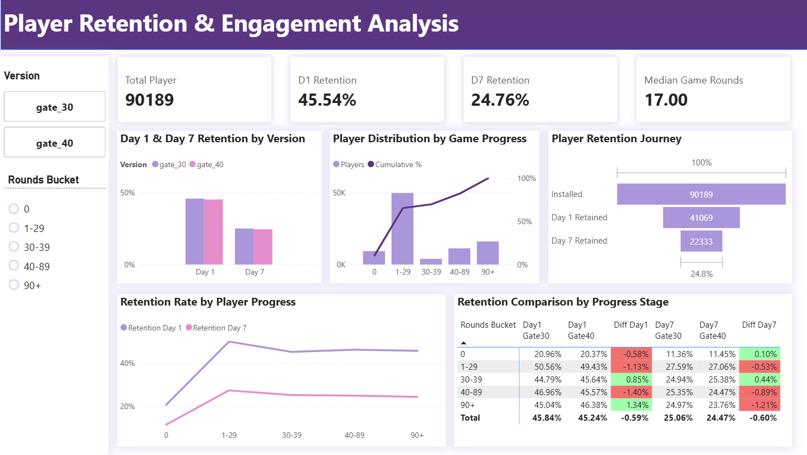

# 🎮 Player Retention & Engagement Analysis
## 🛠️ Tools Used
- Python 
- SQL Server
- Power BI
- DAX
## 📌 Project Overview

This project analyzes an A/B testing experiment conducted in the mobile game Cookie Cats. The goal is to evaluate whether moving the first progression gate from Level 30 to Level 40 improves player engagement and retention.

The analysis combines Python, SQL Server, and Power BI to perform data cleaning, exploratory analysis, statistical testing, and interactive dashboard visualization.

## ❓ Business Problem

- The Product Team wants to answer the following question: Does moving the first gate from Level 30 to Level 40 improve player engagement and retention?

- Changing game progression can influence player behavior. While delaying the first gate may allow players to enjoy uninterrupted gameplay for longer, it may also reduce the psychological motivation to return.

- This experiment aims to determine whether the new gate placement produces measurable improvements before releasing the update to all players.

## 📁 Dataset

- userid :	Unique player ID
- version : 	gate_30 / gate_40
- sum_gamerounds :	Total game rounds played
- retention_1 : 	Returned after 1 day
- retention_7	: Returned after 7 days

## 🧹 Data Cleaning

The following preprocessing steps were performed:
- Checked missing values.
- Checked duplicate players.
- Converted Boolean values (True/False) into Binary (1/0).
- Investigated missing values in sum_gamerounds.
- Excluded missing game rounds only for engagement analysis to avoid creating synthetic player behavior.

## 📊 Dashboard Architecture & Key Visuals

**Key Insights**
1. Moving the First Gate to Level 40 Reduced Overall Retention
- Day 1 Retention decreased from 45.84% to 45.24% (-0.59%).
- Day 7 Retention decreased from 25.06% to 24.47% (-0.60%).
- Moving the first gate from Level 30 to Level 40 did not improve player retention. While the decline in Day 1 Retention was relatively small, the lower Day 7 Retention indicates a negative impact on long-term player retention.

2. The Impact of Gate Placement Varied Across Player Segments
- Player response differed depending on progression stage.
- Players in the 30–39 rounds segment showed higher retention under Gate 40 (+0.85% Day 1, +0.44% Day 7).
- Players in the 40–89 rounds segment experienced lower retention at both Day 1 (-1.40%) and Day 7 (-0.89%).
- The 90+ rounds segment showed a mixed result, with higher Day 1 Retention (+1.34%) but lower Day 7 Retention (-1.21%).
- Delaying the gate benefited players immediately before the new gate, but the improvement was not sustained across later progression stages or reflected in overall retention.

3. The Largest Player Segment Contributed Most to the Overall Decline
- More than 55% of players belonged to the 1–29 rounds segment, making it the largest player group. This segment also recorded lower retention under Gate 40 (-1.13% Day 1 and -0.53% Day 7).
- Because this segment represents the majority of the player base, even a modest decline in retention had a significant impact on the overall experiment results.

## 🚀 Actionable Recommendations
1. Keep the first gate at Level 30.
- The experiment did not demonstrate an improvement in overall retention after moving the gate to Level 40. Retaining the current gate placement is the safer product decision based on the observed results.

2. Investigate retention loss in the 1–29 rounds segment.
- Since this group accounts for more than half of all players and experienced lower retention under Gate 40, further analysis should focus on understanding why these players disengage and identifying opportunities to improve their early gameplay experience.

3. Further evaluate progression design with targeted A/B tests.
- Although Gate 40 improved retention for players in the 30–39 rounds segment, the benefit did not translate into higher overall retention. Future experiments should evaluate other progression mechanics, such as gate difficulty, reward timing, or progression pacing, while validating results with statistical significance testing before deployment.
