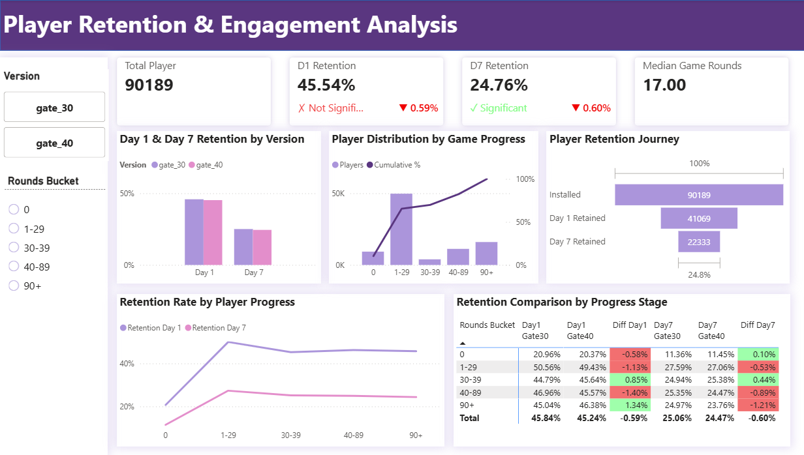

# Player Retention & Engagement Analysis

An A/B-test analysis of whether moving Cookie Cats' first progression gate from level 30 to
level 40 improves player retention. The project combines reproducible Python analysis, SQL
Server queries, and a Power BI dashboard for product stakeholders.



## Decision summary

| Metric | Gate 30 | Gate 40 | Difference | p-value | Result |
|---|---:|---:|---:|---:|---|
| Day 1 retention | 45.84% | 45.24% | -0.59 pp | 0.0728 | Not statistically significant |
| Day 7 retention | 25.06% | 24.47% | -0.60 pp | 0.0384 | Statistically significant |

Gate 40 did not improve either retention metric. The Day 7 decline is statistically
significant at the 5% level, so the recommended product decision is to retain Gate 30 and
test other progression mechanics.

The dashboard also segments players by observed game rounds. These segment views are
descriptive only: game rounds are measured after treatment and must not be interpreted as
causal treatment effects.

## Data quality policy

The public Cookie Cats dataset contains 90,189 randomized players. Download it from the
[Kaggle dataset
page](https://www.kaggle.com/datasets/mursideyarkin/mobile-games-ab-testing-cookie-cats)
and save it as `data/cookie_cats.csv`.

The analysis validates required columns, unique player IDs, treatment values, Boolean
retention values, and non-negative game rounds. Retention analysis keeps every row with a
valid retention outcome. Engagement analysis uses complete cases for `sum_gamerounds`;
missing rounds are never imputed from retention outcomes.

## Reproduce the analysis

Python 3.11 or later is sufficient; the script uses only the standard library.

```bash
python analysis.py --input data/cookie_cats.csv --output output
python -m unittest discover -s tests -v
```

Outputs:

- `output/retention_summary.csv`: group sizes, retention rates, differences, z-statistics,
  and two-sided p-values.
- `output/progress_summary.csv`: descriptive retention by version and rounds bucket.

Run `gaming.sql` in SQL Server after importing the validated data as `dbo.gaming_data`.
Open `gaming.pbix` to inspect the interactive report.

## Repository contents

- `analysis.py` — validation, KPI calculation, A/B significance tests, and CSV exports.
- `gaming.sql` — explicit, independently runnable SQL Server queries.
- `gaming.pbix` and `gaming.png` — interactive dashboard and preview.
- `tests/` — behavior tests for validation and metric calculations.

## Method notes

- Randomization balance is checked using treatment group counts.
- Day 1 and Day 7 retention are tested with two-sided two-proportion z-tests.
- Statistical significance and practical effect size are reported together.
- This dataset contains retention outcomes, not DAU/MAU time series; DAU and MAU are
  therefore not fabricated or inferred.
